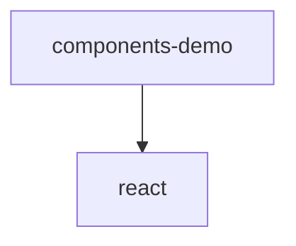

# Module: components/demo

[← Back to INDEX](../../INDEX.md)

**Type:** implicit | **Files:** 5

## Files

| File | Lines | Large |
| ---- | ----- | ----- |
| `components/demo/error-view.tsx` | 36 |  |
| `components/demo/results-view.tsx` | 116 |  |
| `components/demo/scanning-view.tsx` | 46 |  |
| `components/demo/upload-progress.tsx` | 37 |  |
| `components/demo/upload-zone.tsx` | 76 |  |

---

## External Dependencies

Dependencies from other modules:

- `react`
