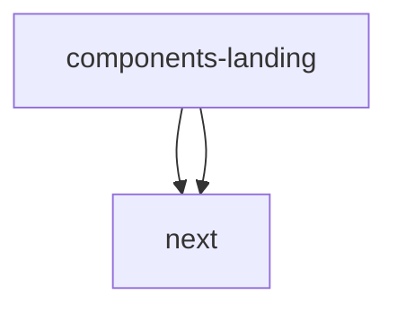

# Module: components/landing

[← Back to INDEX](../../INDEX.md)

**Type:** implicit | **Files:** 5

## Files

| File | Lines | Large |
| ---- | ----- | ----- |
| `components/landing/background-grid.tsx` | 26 |  |
| `components/landing/features.tsx` | 106 |  |
| `components/landing/footer.tsx` | 51 |  |
| `components/landing/header.tsx` | 42 |  |
| `components/landing/hero.tsx` | 62 |  |

---

## External Dependencies

Dependencies from other modules:

- `next/image`
- `next/link`
