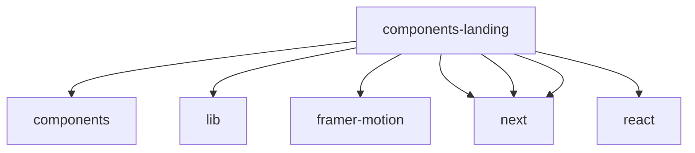

# Imports

[← Back to MODULE](MODULE.md) | [← Back to INDEX](../../INDEX.md)

## Dependency Graph

## External Dependencies

Dependencies from other modules:

- `@/components/theme-toggle`
- `@/lib/utils`
- `framer-motion`
- `next/image`
- `next/link`
- `next/navigation`
- `react`

