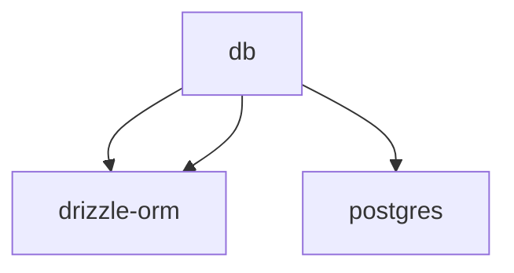

# Module: db

[← Back to INDEX](../../INDEX.md)

**Type:** js/ts | **Files:** 3

**Entry point:** `db/index.ts`

## Files

| File | Lines | Large |
| ---- | ----- | ----- |
| `db/client.ts` | 26 |  |
| `db/index.ts` | 2 |  |
| `db/schema.ts` | 84 |  |

---

## External Dependencies

Dependencies from other modules:

- `drizzle-orm/pg-core`
- `drizzle-orm/postgres-js`
- `postgres`
